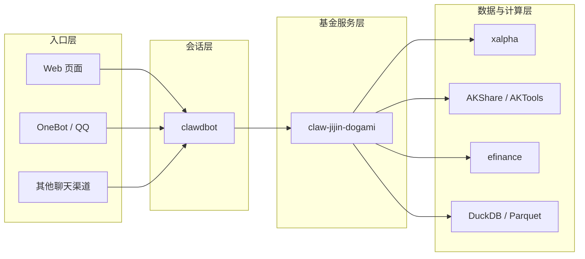

# Architecture

## 1. 当前架构决策

本项目采用 **方案 A**：

- `claw-jijin-dogami` 负责基金分析、数据、规则、评测
- `clawdbot` 负责多入口会话、用户交互、异步任务编排、结果回传

也就是说：

- `claw-jijin-dogami` 是**独立后端服务**
- `clawdbot` 是**多入口会话层与调度层**

这套设计同时适配：

- Web 页面直聊
- OneBot / QQ
- 后续 Telegram、Discord、飞书等聊天渠道

## 2. 角色边界

### 2.1 `claw-jijin-dogami`

职责：

- 管理持仓账本与组合画像
- 同步国内基金与市场数据
- 做基金持仓穿透与风险分析
- 做事件影响分析
- 做历史截断回放与策略评测
- 输出结构化结果，供 AI 或前端消费

不负责：

- 渠道接入
- 聊天会话管理
- 长文本多轮对话编排
- 渠道消息格式适配

### 2.2 `clawdbot`

职责：

- 接入页面聊天与 OneBot 等消息渠道
- 管理用户会话与上下文
- 将自然语言解析为基金领域任务
- 调用 `claw-jijin-dogami` 的同步或异步接口
- 将结构化结果组织成适合当前渠道的回复
- 维护任务状态、通知与回传

不负责：

- 裸算收益率、XIRR、最大回撤
- 直接维护基金历史库
- 单独承担消息影响规则计算

## 3. 核心抽象

在正式开发前，需要先统一这些领域对象。

### 3.1 用户与投资身份

#### `UserIdentity`

统一用户身份，不与单一聊天渠道绑定。

建议字段：

- `user_id`
- `display_name`
- `timezone`
- `risk_profile`
- `created_at`
- `updated_at`

#### `ChannelBinding`

将不同入口映射到同一个投资身份。

建议字段：

- `binding_id`
- `user_id`
- `channel_type`：`web / onebot / telegram / discord / ...`
- `channel_user_id`
- `channel_account_id`
- `status`

### 3.2 投资组合

#### `Portfolio`

一个用户可以有多个组合，例如：

- 主账户
- 长期定投组合
- 高风险尝试组合

建议字段：

- `portfolio_id`
- `user_id`
- `name`
- `base_currency`
- `strategy_mode`
- `status`

#### `HoldingLot`

记录交易与份额变化来源。

建议字段：

- `lot_id`
- `portfolio_id`
- `fund_code`
- `tx_type`
- `tx_date`
- `confirm_date`
- `amount`
- `shares`
- `fee`
- `nav`

### 3.3 基金与市场数据

#### `FundInstrument`

- `fund_code`
- `fund_name`
- `fund_type`
- `company`
- `benchmark`
- `fee_profile`

#### `FundSnapshot`

点位快照，强调“当时能看到什么”。

- `snapshot_id`
- `fund_code`
- `snapshot_date`
- `nav`
- `acc_nav`
- `rank`
- `rank_pct`
- `published_at`
- `source`

#### `PortfolioDisclosureSnapshot`

基金披露持仓快照。

- `disclosure_id`
- `fund_code`
- `report_period`
- `published_at`
- `holdings`
- `industry_exposure`

### 3.4 事件与分析

#### `MarketEvent`

统一消息、公告、政策、宏观事件。

- `event_id`
- `event_type`：`news / policy / macro / company / industry / announcement`
- `title`
- `body`
- `published_at`
- `tags`
- `source`

#### `ImpactAnalysis`

事件影响分析结果。

- `analysis_id`
- `portfolio_id`
- `event_id`
- `cutoff_ts`
- `impacted_funds`
- `portfolio_impact_score`
- `confidence`
- `reasoning_summary`

#### `Recommendation`

结构化建议输出。

- `recommendation_id`
- `portfolio_id`
- `cutoff_ts`
- `scope`：`fund / portfolio`
- `action`：`buy / hold / reduce / switch / avoid / observe`
- `score`
- `confidence`
- `reasons`
- `risk_flags`

### 3.5 评测与任务

#### `ReplayRun`

历史回放任务定义。

- `replay_id`
- `portfolio_id`
- `cutoff_ts`
- `horizons`
- `benchmark_set`
- `status`

#### `BacktestRun`

策略回测任务定义。

- `backtest_id`
- `portfolio_id`
- `strategy_id`
- `period`
- `status`

#### `AsyncJob`

统一异步任务抽象。

- `job_id`
- `job_type`
- `user_id`
- `portfolio_id`
- `request_payload`
- `status`
- `progress`
- `result_ref`
- `error_code`
- `created_at`
- `updated_at`

## 4. 集成方式

### 4.1 总体关系

### 4.2 调用原则

任何入口都不应该直接操作基金内部逻辑。

统一原则：

- 渠道只接触 `clawdbot`
- `clawdbot` 只调用 `claw-jijin-dogami`
- `claw-jijin-dogami` 负责统一计算与标准输出

这样可以保证：

- Web 和 OneBot 用同一套分析能力
- 输出一致，可审计
- 后续扩展渠道不需要重写业务逻辑

## 5. 同步接口与异步接口划分

### 5.1 适合同步返回的能力

这些能力一般可在一次请求内完成：

- 当前组合概览
- 单只基金简要分析
- 单条消息影响分析
- 基础问答类解释

建议接口：

- `POST /v1/portfolio/analyze`
- `POST /v1/fund/analyze`
- `POST /v1/event/impact`

### 5.2 适合异步任务的能力

这些能力可能耗时较长，应统一走任务系统：

- 历史回放
- 策略回测
- 全量数据刷新
- 日报 / 周报 / 月报生成
- 大批量消息影响评估

建议接口：

- `POST /v1/jobs/replay`
- `POST /v1/jobs/backtest`
- `POST /v1/jobs/report`
- `POST /v1/jobs/refresh`
- `GET /v1/jobs/{job_id}`
- `GET /v1/jobs/{job_id}/result`

## 6. `clawdbot` 如何结合

### 6.1 页面直聊模式

页面是完整能力入口，适合：

- 深度问答
- 图表展示
- 回测参数配置
- 历史回放
- 报告查看

页面模式建议：

- 优先调同步接口获取核心摘要
- 对耗时能力创建异步任务
- 页面显示任务状态、阶段日志、结果摘要

### 6.2 OneBot / 聊天模式

聊天渠道是轻量入口，适合：

- 快速提问
- 快速看结论
- 收通知
- 触发异步任务
- 查询任务状态

聊天模式建议：

- 只回简洁摘要
- 对大结果返回 `任务编号 + 简报`
- 支持用户后续追问任务状态或查看结论

### 6.3 统一交互语义

不论是页面还是聊天，内部都应收敛为统一意图：

- `portfolio_status`
- `fund_analysis`
- `event_impact`
- `recommendation`
- `replay_run`
- `backtest_run`
- `job_status`

## 7. 推荐 API 抽象

下面是建议先稳定下来的服务契约。

### 7.1 组合分析

`POST /v1/portfolio/analyze`

请求建议包含：

- `user_id`
- `portfolio_id`
- `cutoff_ts`
- `mode`

响应建议包含：

- `portfolio_summary`
- `holdings`
- `risk_metrics`
- `alerts`
- `recommendation_summary`

### 7.2 事件影响

`POST /v1/event/impact`

请求建议包含：

- `user_id`
- `portfolio_id`
- `event`
- `cutoff_ts`

响应建议包含：

- `event_summary`
- `impacted_funds`
- `portfolio_impact_score`
- `confidence`
- `reasoning_summary`

### 7.3 历史回放

`POST /v1/jobs/replay`

请求建议包含：

- `user_id`
- `portfolio_id`
- `cutoff_ts`
- `horizons`
- `benchmark_set`

立即返回：

- `job_id`
- `status`
- `accepted_at`

结果建议包含：

- `analysis_snapshot`
- `recommendations`
- `realized_performance`
- `benchmark_comparison`
- `evaluation_metrics`

## 8. 输出分层

为了兼容多入口，结果分成三层：

### 8.1 核心结构化层

给程序消费，必须稳定。

### 8.2 展示摘要层

给页面 / 聊天渲染，允许格式差异。

### 8.3 AI 解释层

给用户看的自然语言结论，必须建立在结构化结果之上。

也就是：

- 规则与数据先出结构化结果
- AI 再解释结构化结果

## 9. 权限与安全边界

### 9.1 不在聊天会话里保存持仓真相

聊天 session 只保存上下文，不保存投资真相。

真相数据必须落在：

- 组合账本
- 快照表
- 评测记录

### 9.2 渠道绑定与账户隔离

必须先建立 `ChannelBinding`，再允许渠道访问组合。

避免出现：

- 页面看的是 A 组合
- QQ 查到的是 B 组合
- 不同渠道互相串号

### 9.3 AI 权限边界

AI 可以：

- 读结构化结果
- 生成解释
- 提出建议

AI 不可以：

- 跳过规则层直接生成关键数值
- 绕过快照边界读取未来信息
- 把未经校验的结果直接当成事实写回账本

## 10. 数据与评测边界

历史回放必须坚持 **point-in-time** 原则：

- 只能读取 `cutoff_ts` 之前公开可见的数据
- 基金持仓只能读取当时已披露的最近快照
- 宏观和新闻必须按发布时间截断
- AI 在回放模式下禁止联网读取未来信息

## 11. 开发顺序建议

建议按下面顺序推进：

1. 先做领域对象与数据表
2. 再做基金服务核心接口
3. 再做异步任务系统
4. 再接页面模式
5. 再接 OneBot 模式
6. 最后补历史回放与评测闭环

## 12. 当前结论

当前已经明确：

- 项目采用方案 A
- `clawdbot` 是入口层，不承载基金核心逻辑
- `claw-jijin-dogami` 是基金分析与评测服务
- 页面和 OneBot 共享同一套后端能力
- 历史回放是系统可信度的核心能力，不是附属功能

